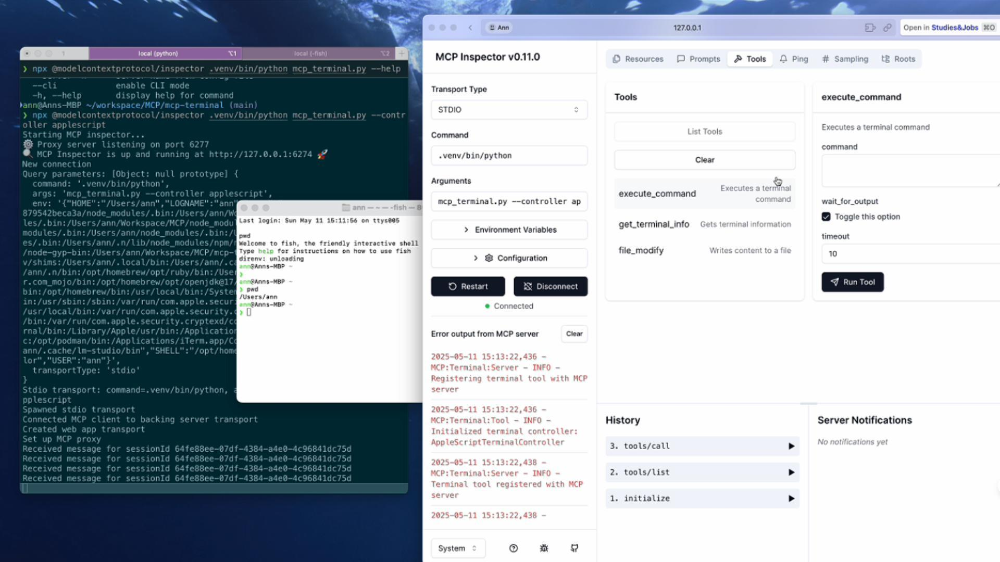
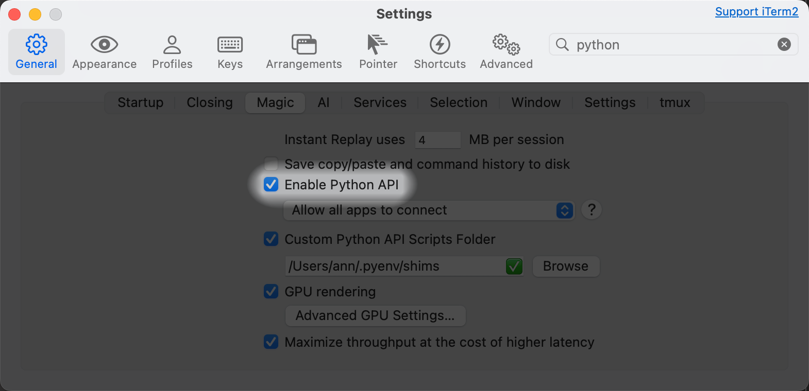

<div align="center">

# MCP Terminal

MCP Terminal 是一个基于 MCP（Model Context Protocol）的终端控制服务器，专为与大型语言模型（LLM）和 AI 助手集成而设计。它提供了一个标准化的接口，使 AI 可以执行终端命令并获取输出结果。

<a href="https://glama.ai/mcp/servers/@sichang824/mcp-terminal">
  
</a>

[English](README.en.md) | 中文

</div>

## 演示视频

[](https://player.bilibili.com/player.html?isOutside=true&aid=114488023981820&bvid=BV1agEuzGE1X&cid=29904276803&p=1)

## 特性

- 使用官方 MCP SDK 实现
- 支持多种终端控制器：
  - **iTerm2 控制器**：在 macOS 上使用 iTerm2 的 Python API 提供高级控制
  - **AppleScript 控制器**：在 macOS 上使用 AppleScript 控制 Terminal 应用
  - **Subprocess 控制器**：在所有平台上通用的终端控制方式
- 支持多种服务器模式：
  - **STDIO 模式**：通过标准输入/输出与客户端通信
  - **SSE 模式**：通过 Server-Sent Events 提供 HTTP API
- 提供多种工具：
  - **终端工具**：执行命令并获取输出
  - **文件工具**：进行文件操作（读写、追加、插入）
- 自动检测最佳终端控制器
- 与 Claude Desktop 无缝集成
- 支持 Docker 部署

## 安装

### 先决条件

- Python 3.8+
- [uv](https://github.com/astral-sh/uv) 包管理工具

如果您还没有安装 uv，可以通过以下命令安装：

```bash
# 在macOS上使用Homebrew
brew install uv

# 在其他平台上
pip install uv
```

### 使用 uv 安装（推荐）

克隆仓库并使用 uv 安装依赖：

```bash
# 克隆仓库
git clone https://github.com/yourusername/mcp-terminal.git
cd mcp-terminal

# 创建虚拟环境并安装基本依赖
uv venv
source .venv/bin/activate  # 在Windows上使用 .venv\Scripts\activate
uv pip install -e .

# 如果需要iTerm2支持 (仅限macOS)
uv pip install -e ".[iterm]"

# 如果需要开发工具（测试、代码格式化等）
uv pip install -e ".[dev]"
```

> **注意：如需使用 iTerm2 控制器，必须在 iTerm2 设置中启用 Python API。**
>
> 打开 iTerm2，依次进入 `Preferences` → `General` → `Magic`，勾选 **Enable Python API** 选项，如下图所示：
>
> 

### 使用 Makefile 安装

我们提供了 Makefile 来简化常见操作：

```bash
# 安装基本依赖
make setup

# 安装iTerm2支持
make setup-iterm

# 安装开发依赖
make setup-dev
```

### 使用 Docker 安装

我们提供了 Docker 支持，可以快速部署 MCP Terminal 服务器：

```bash
# 构建 Docker 镜像
docker build -t mcp-terminal .

# 运行 Docker 容器（SSE模式，端口8000）
docker run -p 8000:8000 mcp-terminal
```

或者使用 docker-compose：

```bash
# 启动服务
docker-compose up -d

# 查看日志
docker-compose logs -f

# 停止服务
docker-compose down
```

## 使用方法

### 运行 MCP 终端服务器

有多种方式可以启动服务器：

```bash
# 使用Python直接运行（默认使用stdio模式和自动检测终端控制器）
python mcp_terminal.py

# 使用Makefile运行（stdio模式）
make run-stdio

# 使用Makefile运行（SSE模式）
make run-sse

# 使用指定控制器
make run-iterm     # 使用iTerm2控制器
make run-applescript  # 使用AppleScript控制器
make run-subprocess   # 使用Subprocess控制器
```

### 使用 Docker 运行

使用 Docker 运行 MCP Terminal 服务器（默认使用 SSE 模式和 Subprocess 控制器）：

```bash
# 直接运行
docker run -p 8000:8000 mcp-terminal

# 使用自定义端口
docker run -p 9000:8000 mcp-terminal

# 挂载当前目录（可访问本地文件）
docker run -p 8000:8000 -v $(pwd):/workspace mcp-terminal
```

默认配置：

- 服务器模式：SSE
- 主机：0.0.0.0（允许远程连接）
- 端口：8000
- 控制器：subprocess（适合容器环境）

您可以通过修改 Dockerfile 或 docker-compose.yml 文件来自定义配置。

### 在 Claude 或其他 AI 中使用 Docker 容器作为 MCP 服务

您可以将 Docker 容器配置为 MCP 服务，使 Claude 或其他支持 MCP 的 AI 可以直接使用容器化的工具。以下是在 Claude 配置文件中使用 Docker 容器作为 MCP 服务的示例：

```json
{
  "mcp": {
    "servers": {
      "terminal": {
        "command": "docker",
        "args": [
          "run",
          "--rm",
          "-i",
          "--mount",
          "type=bind,src=${workspaceFolder},dst=/workspace",
          "mcp-terminal",
          "mcp-terminal",
          "--mode",
          "sse",
          "--host",
          "0.0.0.0",
          "--port",
          "8000"
        ]
      }
    }
  }
}
```

这种配置允许：

- 通过 Docker 容器隔离工具执行环境
- 无需在本地安装特定工具即可使用其功能
- 在不同环境中保持一致的工具版本和配置
- 使用 `${workspaceFolder}` 变量将当前工作目录挂载到容器中
- 通过 `--rm` 标志确保容器使用后自动删除，保持环境清洁

您可以根据需要定义多个不同的 MCP 服务容器，每个容器专注于特定的功能。

### Claude Desktop 集成配置示例

以下是 Claude Desktop 的配置示例：

```json
{
  "mcpServers": {
    "terminal": {
      "command": "/Users/ann/Workspace/mcp-terminal/.venv/bin/python",
      "args": [
        "/Users/ann/Workspace/mcp-terminal/mcp_terminal.py",
        "--controller",
        "subprocess"
      ]
    }
  }
}
```

### 命令行选项

服务器支持多种命令行选项：

```bash
python mcp_terminal.py --help
```

主要选项：

- `--controller` 或 `-c`：指定终端控制器类型（auto, iterm, applescript, subprocess）
- `--mode` 或 `-m`：指定服务器模式（stdio, sse）
- `--host`：指定 SSE 模式主机地址
- `--port` 或 `-p`：指定 SSE 模式端口
- `--log-level` 或 `-l`：指定日志级别

## 与 Claude Desktop 集成

MCP Terminal 可以与 Claude Desktop 无缝集成，为 Claude 提供终端控制能力。

### 配置步骤

1. **启动 MCP Terminal 服务器**（以 stdio 模式）：

   ```bash
   # 在一个终端窗口中运行
   make run-stdio
   ```

2. **配置 Claude Desktop 使用 MCP 服务器**：

   打开 Claude Desktop，然后：

   - 点击设置图标（通常在右上角）
   - 导航到"扩展"或"工具"选项卡
   - 启用"自定义工具"功能
   - 添加 MCP Terminal 的配置：
     - 工具名称：Terminal
     - 工具路径：输入 mcp_terminal.py 的完整路径
     - 使用 stdio 模式：勾选
     - 保存配置

3. **测试集成**：

   在与 Claude 的对话中，你现在可以请求 Claude 执行终端命令，例如：

   - "请列出我的主目录下的文件"
   - "检查我当前的 Python 版本"
   - "创建一个新目录并将当前日期写入一个文件"

### 故障排除

如果集成不正常工作：

1. 确保 MCP Terminal 服务器正在运行
2. 检查日志输出以查找错误
3. 验证 Claude Desktop 的工具配置是否正确
4. 尝试重启 Claude Desktop 和 MCP Terminal 服务器

## API 规范

MCP Terminal 提供以下 MCP 函数：

### execute_command

执行终端命令并获取输出结果。

**参数**：

- `command` (string)：要执行的命令
- `wait_for_output` (boolean, 可选)：是否等待并返回命令输出，默认为 true
- `timeout` (integer, 可选)：等待输出的超时时间（秒），默认为 10

**返回**：

- `success` (boolean)：命令是否成功执行
- `output` (string, 可选)：命令的输出结果
- `error` (string, 可选)：如果命令失败，返回错误信息
- `return_code` (integer, 可选)：命令的返回代码
- `warning` (string, 可选)：警告信息

### get_terminal_info

获取终端信息。

**参数**：无

**返回**：

- `terminal_type` (string)：正在使用的终端类型
- `platform` (string)：运行平台

### file_modify

写入、追加或插入内容到文件。

**参数**：

- `filepath` (string)：文件路径
- `content` (string)：要写入的内容
- `mode` (string, 可选)：写入模式，可选值为 "overwrite"（覆盖）、"append"（追加）或 "insert"（插入），默认为 "overwrite"
- `position` (integer, 可选)：使用 "insert" 模式时的插入位置
- `create_dirs` (boolean, 可选)：如果目录不存在，是否创建目录，默认为 true

**返回**：

- `success` (boolean)：操作是否成功
- `error` (string, 可选)：如果操作失败，返回错误信息
- `filepath` (string)：操作的文件路径
- `details` (object, 可选)：额外的操作详情

## 安全考虑

MCP Terminal 允许执行任意终端命令，这可能带来安全风险。在生产环境中使用时，应该：

1. 限制服务器只接受来自受信任来源的连接
2. 考虑实现命令白名单或黑名单
3. 定期审计执行的命令
4. 在专用账户下运行服务器，限制其权限

## 开发

### 目录结构

```
mcp-terminal/
├── mcp_terminal.py            # 入口点脚本
├── pyproject.toml             # 项目配置和依赖
├── README.md                  # 项目文档
├── Makefile                   # 构建和运行命令
├── Dockerfile                 # Docker 构建配置
├── docker-compose.yml         # Docker Compose 配置
├── src/
│   ├── __init__.py
│   └── mcp_terminal/
│       ├── __init__.py
│       ├── server.py          # 主服务器实现
│       ├── controllers/
│       │   ├── __init__.py    # 控制器工厂和导入
│       │   ├── base.py        # 基础控制器接口
│       │   ├── subprocess.py  # 通用子进程控制器
│       │   ├── applescript.py # AppleScript控制器
│       │   └── iterm.py       # iTerm2 API控制器
│       └── tools/
│           ├── __init__.py
│           ├── terminal.py    # 终端操作工具
│           └── file.py        # 文件操作工具
└── tests/                     # 测试目录
    ├── __init__.py
    └── test_subprocess_controller.py
```

### 运行测试

```bash
# 使用pytest运行所有测试
make test

# 或者直接使用pytest
pytest tests/
```

### 代码格式化

```bash
# 检查代码格式
make lint

# 自动格式化代码
make format
```

## 贡献

欢迎贡献！请遵循以下步骤：

1. Fork 仓库
2. 创建功能分支 (`git checkout -b feature/amazing-feature`)
3. 提交更改 (`git commit -m 'Add some amazing feature'`)
4. 推送到分支 (`git push origin feature/amazing-feature`)
5. 提交 Pull Request

## 许可证

此项目采用 MIT 许可证 - 详情见[LICENSE](LICENSE)文件。
